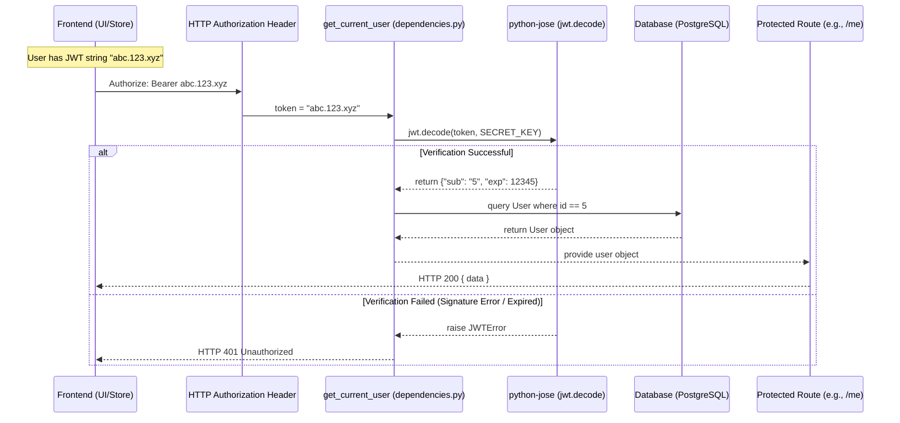

# Authorized Request Flow (The JWT Journey)

This diagram describes what happens *after* a user is logged in and starts making requests with their JWT.

```mermaid
sequenceDiagram
    participant Client as Frontend (UI/Store)
    participant Header as HTTP Authorization Header
    participant Auth as get_current_user (dependencies.py)
    participant JWT as python-jose (jwt.decode)
    participant DB as Database (PostgreSQL)
    participant Route as Protected Route (e.g., /me)

    Note over Client: User has JWT string "abc.123.xyz"
    Client->>Header: Authorize: Bearer abc.123.xyz
    Header->>Auth: token = "abc.123.xyz"
    
    Auth->>JWT: jwt.decode(token, SECRET_KEY)
    
    alt Verification Successful
        JWT-->>Auth: return {"sub": "5", "exp": 12345}
        Auth->>DB: query User where id == 5
        DB-->>Auth: return User object
        Auth-->>Route: provide user object
        Route-->>Client: HTTP 200 { data }
    else Verification Failed (Signature Error / Expired)
        JWT-->>Auth: raise JWTError
        Auth-->>Client: HTTP 401 Unauthorized
    end
```
