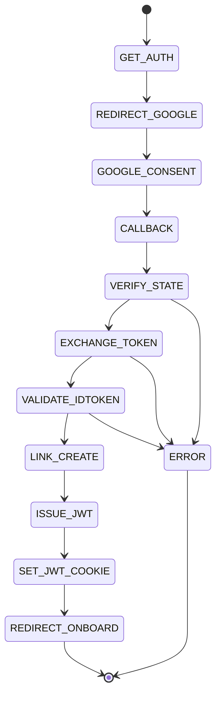

**Google OAuth — /auth/google (FastAPI)**

**Line labels:**
- `GET_AUTH` — GET /auth/google
- `REDIRECT_GOOGLE` — Google consent URL
- `CALLBACK` — /auth/google callback (code,state)
- `VERIFY_STATE` — verify state cookie
- `EXCHANGE_TOKEN` — POST to Google token endpoint
- `VALIDATE_IDTOKEN` — validate id_token
- `LINK_CREATE` — find/link/create Account
- `ISSUE_JWT` — create local JWT
- `SET_JWT_COOKIE` — set readable `jwt` cookie on .till-failure.us
- `REDIRECT_ONBOARD` — redirect to /onboarding
- `ERROR` — failure

File created: [flows/auth/google_oauth.md](flows/auth/google_oauth.md)
