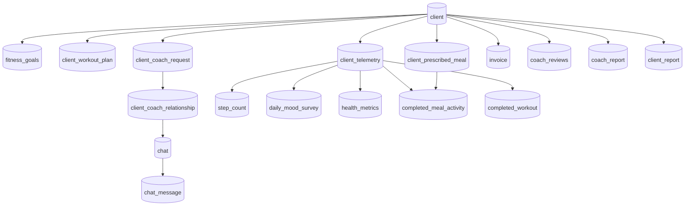

# Client Role Cascade Reach

```mermaid
flowchart TD
    C[(client)]

    C --> FG[(fitness_goals)]
    C --> CWP[(client_workout_plan)]
    C --> CPR[(client_coach_request)]
    C --> CTE[(client_telemetry)]
    C --> CPM[(client_prescribed_meal)]
    C --> INV[(invoice)]
    C --> CRV[(coach_reviews)]
    C --> CRP[(coach_report)]
    C --> CLR[(client_report)]

    CPR --> CCR[(client_coach_relationship)]
    CCR --> CH[(chat)]
    CH --> CM[(chat_message)]

    CTE --> SC[(step_count)]
    CTE --> DMS[(daily_mood_survey)]
    CTE --> HM[(health_metrics)]
    CTE --> CMA[(completed_meal_activity)]
    CTE --> CW[(completed_workout)]

    CPM --> CMA
```
