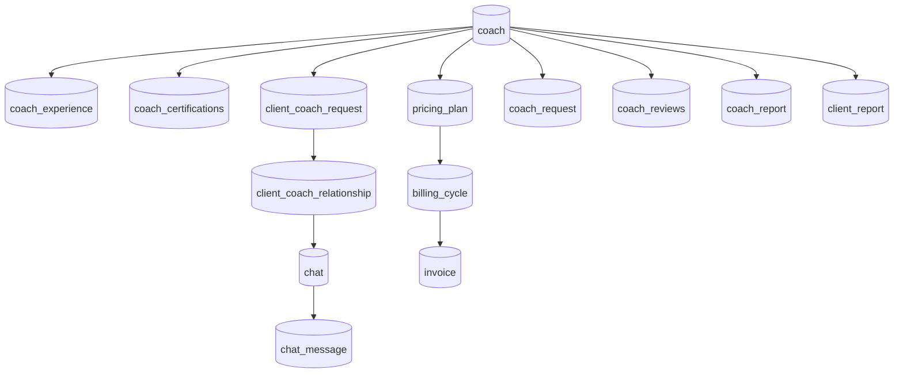

# Coach Role Cascade Reach

```mermaid
flowchart TD
    K[(coach)]

    K --> CE[(coach_experience)]
    K --> CC[(coach_certifications)]
    K --> CPR[(client_coach_request)]
    K --> PP[(pricing_plan)]
    K --> CReq[(coach_request)]
    K --> CRV[(coach_reviews)]
    K --> CRP[(coach_report)]
    K --> CLR[(client_report)]

    CPR --> CCR[(client_coach_relationship)]
    CCR --> CH[(chat)]
    CH --> CM[(chat_message)]

    PP --> BC[(billing_cycle)]
    BC --> INV[(invoice)]
```
